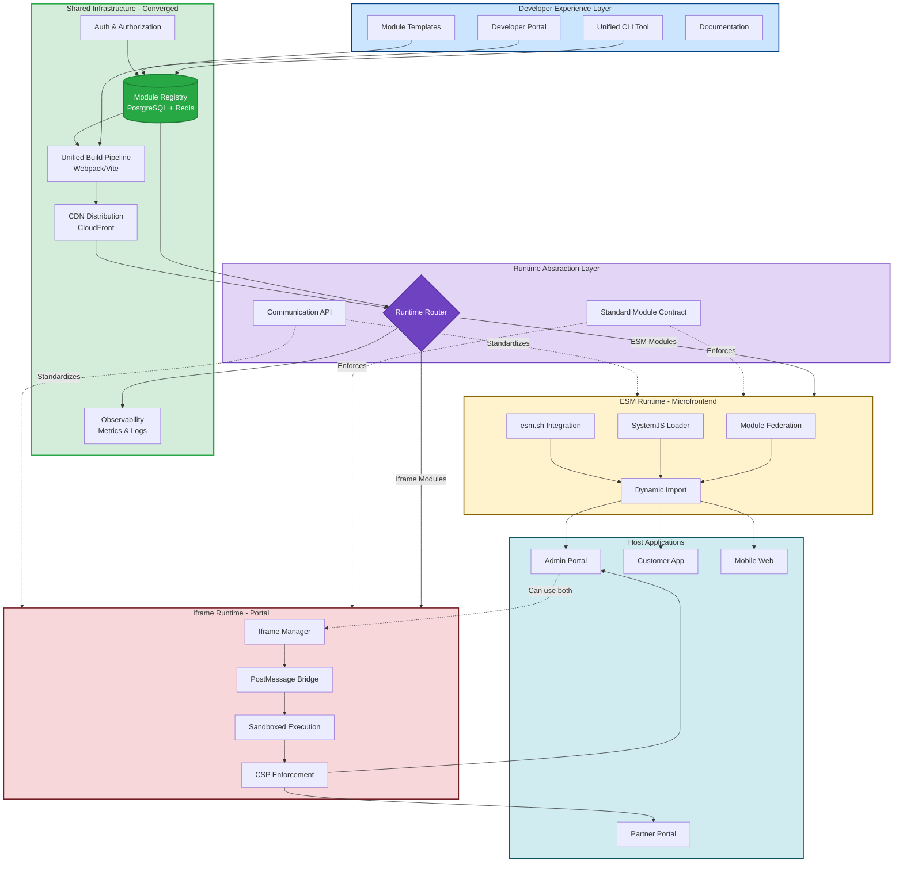

======= intro
Recommended Approach: Unified Module Registry + Runtime Abstraction Layer
Core Strategy: Converge on shared infrastructure while maintaining runtime flexibility where legitimately needed.
Phase 1: Shared Services (Immediate)
Consolidate the self-service layer first since both runtimes need identical capabilities:

Unified Module Registry - Single source of truth for module metadata, versions, dependencies, and ownership
Common Module Lifecycle Management - Shared workflows for publishing, versioning, deprecation, and discovery
Single Authentication/Authorization layer for module access control
Consolidated Developer Portal with unified documentation, onboarding, and tooling

Phase 2: Runtime Consolidation Decision (3-6 months)
You need to answer: Do we truly need two runtimes?
If iframe runtime is purely legacy: Create a migration path to the esm.sh-based microfrontend platform. Iframes are generally inferior for microfrontends due to styling isolation issues, performance overhead, and communication complexity.
If both serve distinct use cases:

ESM runtime → Tightly integrated microfrontends (shared state, performance-critical)
Iframe runtime → True isolation needed (security boundaries, third-party untrusted code, legacy apps)

Then build a Runtime Adapter Layer that provides a common interface:
Module Developer → Unified Registry → Runtime Selector → [ESM Runtime | Iframe Runtime]
Phase 3: Technical Convergence
Shared Components:

Module bundling/build pipeline (can output both ESM and iframe-compatible bundles)
Dependency resolution logic
Health monitoring and observability
Development tooling (CLI, templates, linting)

Runtime-Specific:

Keep only the actual loading mechanism different
Standardize communication patterns (events, APIs) across both where possible

Key Decision Point
The critical question: What percentage of your modules legitimately require iframe isolation? If it's <20%, consider deprecating the iframe runtime entirely. If it's >50%, your runtimes may be serving fundamentally different architectural needs and should remain separate with shared infrastructure.
Would you like to explore any specific phase in more detail, or discuss the trade-offs between full consolidation versus maintaining dual runtimes?

======= approach
Discovery & Assessment Phase (2-4 weeks)
1. Map the Current State
Create an inventory:

List all capabilities in each runtime (module loading, routing, state management, error handling, etc.)
Identify duplicated functionality vs. unique features
Document all dependent teams and their modules
Catalog technical debt and pain points in each system

Usage Analysis:

Which teams use which runtime and why?
Module distribution across runtimes (count, criticality, ownership)
Are teams using both? If so, what's driving that?
Performance and reliability metrics for each

2. Stakeholder Alignment Workshop
Bring together: Platform engineers, module developers, product/engineering leaders
Key questions to answer:

What problems are we solving with two runtimes?
What's the cost of maintaining both? (engineering time, cognitive load, onboarding friction)
What's blocking consolidation today?
What are non-negotiable requirements for each consumer team?
What's our risk tolerance for migration?

Strategy Definition Phase (2-3 weeks)
3. Define Target Architecture
Choose one of these patterns:
Option A: Single Runtime Winner

Pick the stronger platform (likely ESM-based)
Migrate iframe users with feature parity plan
Timeline: 12-18 months

Option B: Thin Abstraction Layer

Shared registry + developer experience
Keep both runtimes for distinct use cases
Timeline: 6-9 months

Option C: New Unified Runtime

Build fresh with lessons learned
Support both ESM and iframe loading strategies
Timeline: 18-24 months (riskiest)

4. Create Decision Framework
Document the "why" behind your choice:
Decision Criteria:
□ Technical feasibility score
□ Migration effort (team-months)
□ Risk to production systems
□ Developer experience impact
□ Long-term maintenance cost
□ Time to value
Roadmap Creation (1-2 weeks)
5. Build Phased Roadmap
Example structure for Option B (most common):
Q1 2025: Foundation

✓ Unified module registry (metadata, versioning)
✓ Shared authentication/authorization
✓ Common CLI tooling for module publishing
✓ Migration playbook documentation

Q2 2025: Developer Experience

✓ Single developer portal/documentation site
✓ Unified module template/scaffolding
✓ Common observability dashboard
✓ Deprecate duplicative self-service UIs

Q3 2025: Runtime Optimization

✓ Standardize module communication patterns
✓ Shared dependency resolution
✓ Common build pipeline supporting both outputs
✓ Begin pilot migrations (iframe → ESM for suitable modules)

Q4 2025: Consolidation

✓ Runtime selector/router logic
✓ Migrate 50% of iframe modules (if applicable)
✓ Decommission legacy self-service systems
✓ Complete API standardization

2026: Optimization & Scale

✓ Complete migrations or formalize dual-runtime support
✓ Advanced features (A/B testing, canary deployments)
✓ Focus shifts to value-add vs. infrastructure

6. Define Success Metrics
Track these throughout:

Developer productivity: Time to publish new module
Platform efficiency: Reduction in duplicated code/systems
Reliability: Module load success rate, error rates
Adoption: % of teams on converged platform
Cost: Engineering hours spent on platform maintenance

Execution Framework
7. Governance Model
Create decision-making structure:

Platform Team: Owns technical execution
Steering Committee: Product/eng leaders for priority calls
Working Group: Representatives from consumer teams for feedback

Regular cadences:

Weekly platform team sync
Monthly stakeholder demos
Quarterly roadmap reviews

8. Communication Plan
Announce early and often:

Kick-off: Vision, timeline, what's changing
Monthly updates: Progress, upcoming changes, how to prepare
Migration support: Office hours, documentation, hands-on help
Wins: Celebrate milestones and early adopters

9. Risk Mitigation
Build in safety measures:

Feature flags for gradual rollout
Parallel run period (both systems live)
Rollback plans for each phase
Dedicated migration support squad
Buffer time (add 30% to estimates)

Practical Next Steps (This Week)

Day 1-2: Schedule stakeholder alignment workshop
Day 3: Create current state inventory template and assign owners
Day 4: Draft charter document with problem statement and goals
Day 5: Identify 2-3 pilot teams for early feedback/migration

Roadmap Document Template
markdown# Platform Convergence Roadmap

## Executive Summary
- Problem statement
- Chosen approach
- Timeline and investment
- Expected outcomes

## Current State Assessment
[Your findings from discovery]

## Target Architecture
[Diagrams and technical decisions]

## Phased Delivery Plan
[Quarter-by-quarter breakdown]

## Migration Strategy
[Team-by-team approach]

## Success Metrics
[How we measure progress]

## Risks & Mitigation
[What could go wrong]

## Resource Requirements
[Team capacity needed]
Would you like me to help you draft any specific section, or dive deeper into stakeholder alignment techniques or migration strategies?

=========decisions----
Recommended: Option B - Unified Infrastructure with Dual Runtimes (6-12 months)
Why This Approach
The reality check:

You already have two systems in production with teams depending on them
Full migration (Option A) is 18+ months of high-risk, low-visible-value work
Building new (Option C) compounds the problem temporarily
You can deliver value incrementally while keeping systems stable

The pragmatic path:

Eliminate 70-80% of duplication by converging infrastructure
Let runtimes handle what they're actually different at (loading mechanisms)
Give teams a clear migration path without forcing immediate changes

Concrete Recommendation: 12-Month Plan
Phase 1: Quick Wins (Months 1-3)
Goal: Stop the bleeding - no new duplication

Freeze duplicative development - All new features go into shared services only
Unified Module Registry - Single API/database for module metadata
Single Developer Portal - One place for docs, discovery, publishing
Common CLI tool - npm run publish works for both runtimes

Outcome: Developers see immediate simplification. Your team stops building everything twice.
Phase 2: Technical Foundation (Months 4-6)
Goal: Make runtimes interchangeable from a developer perspective

Standardized Module Contract - Modules declare capabilities, not runtime specifics
Unified Build Pipeline - One build process, outputs optimized for each runtime
Runtime Abstraction Layer - Host apps use common APIs regardless of runtime
Shared Observability - Single dashboard for monitoring all modules

Outcome: A module can theoretically run on either runtime with configuration change, not code rewrite.
Phase 3: Rationalization (Months 7-12)
Goal: Consolidate where it makes sense, formalize where it doesn't

Analyze actual requirements:

Which modules truly need iframe isolation? (security, third-party, legacy)
Which are on iframe only due to historical reasons?

Selective migration:

Move simple iframe modules to ESM (better performance, DX)
Keep complex/isolated modules on iframe
Target: 60-70% on ESM, 30-40% on iframe

Decommission duplicates:

Sunset old self-service UIs
Remove redundant deployment pipelines
Consolidate documentation

Outcome: Two runtimes with clear boundaries, shared infrastructure, minimal duplication.
Critical Success Factors
1. Start with the Registry
This is your keystone. Get this right and everything else flows:
{
  "moduleId": "checkout-widget",
  "version": "2.1.0",
  "owner": "team-commerce",
  "runtime": "esm", // or "iframe" or "auto"
  "dependencies": [...],
  "metadata": {...}
}
2. Developer Experience First
If publishing a module is easier and clearer than before, teams will adopt. If it's harder or confusing, they'll resist. Measure:

Time from code to production
Lines of boilerplate required
Onboarding time for new developers

3. Don't Force Migration
Let value drive adoption:

Make ESM clearly better for most use cases (faster, easier debugging, better DX)
Provide clear criteria for when iframe is appropriate
Some modules may stay on iframe forever - that's okay

4. Sunset Timeline
Set a date now (e.g., end of 2025) when you'll stop maintaining duplicative self-service systems. This creates urgency without forcing runtime migration.
What NOT to Do
❌ Don't try to build the perfect abstraction - You'll spend 2 years architecting and deliver nothing
❌ Don't force all modules to one runtime - Legitimate differences exist
❌ Don't rebuild both runtimes - Evolution beats revolution here
❌ Don't go silent - Communicate constantly with consumers
Investment Required
Team composition:

2-3 platform engineers (full-time)
1 technical writer (50%)
1 product manager (50%)
Steering committee (10% from key stakeholders)

Non-negotiables:

Executive sponsorship for saying "no" to new duplicative features
Protected roadmap time (not interrupted by urgent requests)
Budget for migration support (office hours, pairing sessions)

First Three Actions (This Week)

Schedule 2-hour workshop with platform team and 3-4 key consumer teams - Get alignment on the problem
Create simple inventory - Spreadsheet with all modules, which runtime, why, migration difficulty (1-5)
Draft 1-pager - Problem, proposed approach, ask for feedback from engineering leadership

Why I'm Confident in This
This approach:

De-risks delivery - Value every quarter, not after 18 months
Respects reality - Works with systems teams already depend on
Forces clarity - You'll learn which runtime differences actually matter
Creates optionality - Can deprecate iframe later if usage drops naturally
Delivers tangible wins - Developers feel the improvement immediately

The worst outcome is maintaining two completely separate platforms indefinitely. The best outcome is one seamless platform that happens to support two loading strategies under the hood.
My bet: After 12 months, you'll have 80% of the value of full consolidation at 40% of the cost and risk. And you might discover iframe usage drops to 15% naturally, making full deprecation obvious for Phase 2.
Does this align with your constraints and appetite for change?SDraw a technical diagram of how convergence might look likeI'll create a technical diagram showing the convergence architecture:Platform Convergence ArchitectureInteractive artifact I've created a visual technical diagram showing the converged architecture. Here are the key design principles illustrated:
Architecture Layers
1. Developer Experience (Top) - Single unified interface regardless of target runtime
2. Shared Infrastructure (Middle-Green) - This is where 70-80% of duplication gets eliminated:

Module Registry: Single source of truth for all modules
Build Pipeline: One process that outputs for both runtimes
Observability: Unified monitoring across all modules
Auth/CDN: Common services used by both runtimes

3. Runtime Abstraction Layer (Purple) - The intelligence layer that:

Routes modules to appropriate runtime
Enforces standardized module contracts
Provides common communication APIs

4. Dual Runtimes (Bottom) - Kept separate where they're genuinely different:

ESM Runtime: For tightly integrated, performance-critical microfrontends
Iframe Runtime: For isolated, third-party, or legacy modules

5. Host Applications - Can use either or both runtimes transparently
The key insight: converge on everything except the actual loading mechanism. Developers publish once, the platform handles runtime selection automatically based on module requirements.
Would you like me to create additional diagrams showing the migration path, data flow, or specific integration patterns?

===========
Architecture 
Architecture Layers
1. Developer Experience (Top) - Single unified interface regardless of target runtime
2. Shared Infrastructure (Middle-Green) - This is where 70-80% of duplication gets eliminated:

Module Registry: Single source of truth for all modules
Build Pipeline: One process that outputs for both runtimes
Observability: Unified monitoring across all modules
Auth/CDN: Common services used by both runtimes

3. Runtime Abstraction Layer (Purple) - The intelligence layer that:

Routes modules to appropriate runtime
Enforces standardized module contracts
Provides common communication APIs

4. Dual Runtimes (Bottom) - Kept separate where they're genuinely different:

ESM Runtime: For tightly integrated, performance-critical microfrontends
Iframe Runtime: For isolated, third-party, or legacy modules

5. Host Applications - Can use either or both runtimes transparently
The key insight: converge on everything except the actual loading mechanism. Developers publish once, the platform handles runtime selection automatically based on module requirements.
Would you like me to create additional diagrams showing the migration path, data flow, or specific integration patterns?

Key Elements:

Developer Experience Layer (Blue) - Single unified interface for all developers
Shared Infrastructure (Green) - The converged layer where 70-80% of duplication is eliminated
Runtime Abstraction Layer (Purple) - Intelligence layer that routes modules appropriately
ESM Runtime (Yellow) - For modern, integrated microfrontends
Iframe Runtime (Red) - For isolated, secure portal modules
Host Applications (Cyan) - Various apps that consume modules from either runtime

The thick green border around "Shared Infrastructure" emphasizes this is where the convergence happens - everything flows through the unified registry and build pipeline before splitting into runtime-specific implementations.
Would you like me to create additional Mermaid diagrams showing:

Migration timeline/phases?
Module publishing sequence diagram?
Decision flow for runtime selection?
Data flow between components?

